# Common Platform Product Management Service

## Table of Contents

- [Overview](#overview)
- [Features](#features)
- [Architecture](#architecture)
  - [Modules](#modules)
  - [Technology Stack](#technology-stack)
- [Data Model](#data-model)
- [Quickstart](#quickstart)
  - [Prerequisites](#prerequisites)
  - [Local Development Setup](#local-development-setup)
  - [Docker Deployment](#docker-deployment)
- [API Usage Guide](#api-usage-guide)
  - [Step 1: Create a Product](#step-1-create-a-product)
  - [Step 2: Add Product Features](#step-2-add-product-features)
  - [Step 3: Define Product Pricing](#step-3-define-product-pricing)
  - [Step 4: Set Product Lifecycle](#step-4-set-product-lifecycle)
  - [Step 5: Create Product Relationships](#step-5-create-product-relationships)
  - [Step 6: Add Localization](#step-6-add-localization)
  - [Step 7: Create Product Bundles](#step-7-create-product-bundles)
  - [Step 8: Define Documentation Requirements](#step-8-define-documentation-requirements)
- [Configuration](#configuration)
- [Development Guidelines](#development-guidelines)
  - [Code Style](#code-style)
  - [Testing](#testing)
  - [Branching Strategy](#branching-strategy)
- [Continuous Integration](#continuous-integration)
- [Deployment](#deployment)
- [Contributing](#contributing)

## Overview

The Common Platform Product Management Service is a mission-critical enterprise microservice component of the Firefly platform that functions as both a comprehensive Product Catalog and sophisticated Product Configuration Wizard. As the authoritative centralized repository for all product information across the Firefly ecosystem, it provides a single source of truth for product data throughout the entire product lifecycle, enabling seamless integration with other platform services.

### Product Catalog

As an enterprise-grade Product Catalog, this service:

- Maintains a comprehensive inventory of all financial products offered by the institution with robust versioning capabilities
- Provides detailed product specifications, features, pricing structures, eligibility criteria, and compliance parameters
- Supports multi-language product descriptions and region-specific variations for global deployment and regulatory compliance
- Enables sophisticated product discovery and comparison through rich categorization, tagging, and relationship mapping
- Tracks product versions with immutable audit trails and maintains a complete history of changes over time for governance requirements

### Product Configuration Wizard

As an advanced Product Configuration Wizard, this service:

- Guides product managers through a structured, workflow-driven process of creating and configuring new products
- Enforces complex business rules, validation logic, and compliance requirements during product setup
- Supports sophisticated product bundling, cross-selling strategies, and multi-dimensional relationship definitions
- Manages the complete product lifecycle from conception and draft to active deployment to retirement and archival
- Provides an extensible framework for enhancing products with custom attributes, behaviors, and integration points

The service is built using a reactive programming model with Spring WebFlux and leverages event-driven architecture principles, ensuring enterprise-grade performance, horizontal scalability, and operational resilience even under high-concurrency conditions. The non-blocking I/O model optimizes resource utilization and responsiveness, making it suitable for mission-critical financial applications.

## Enterprise Features

- **Comprehensive Product Management**: Create, read, update, and delete product information with full audit trails and governance controls
- **Intuitive Product Wizard**: Streamline product creation with a step-by-step wizard interface for faster configuration and deployment
- **Hierarchical Product Categorization**: Implement multi-level product taxonomies with flexible categorization schemes and dynamic subtypes
- **Strategic Product Bundling**: Design and manage sophisticated product bundles with configurable pricing strategies and promotional rules
- **Feature-based Configuration**: Define and manage granular product features with conditional availability and eligibility rules
- **Advanced Fee Management**: Configure complex fee structures, tiered pricing components, and conditional application rules
- **Complete Lifecycle Governance**: Track and enforce product lifecycle states, transitions, and approval workflows with regulatory compliance
- **Configurable Product Limits**: Define and enforce product-specific limits with temporal and conditional constraints
- **Global Localization Framework**: Support for product information in multiple languages with region-specific regulatory content
- **Dynamic Pricing Engine**: Manage sophisticated product pricing models including tiered, conditional, and currency-specific pricing
- **Multi-dimensional Relationship Mapping**: Define and visualize complex relationships between products for cross-selling and upselling
- **Enterprise Versioning System**: Track product versions with immutable change history and point-in-time reconstruction capabilities
- **Integrated Documentation Management**: Centrally manage product-related documentation with version control and approval workflows
- **Contracting Documentation Requirements**: Define and manage required documentation for product contracting/opening phases, supporting regulatory compliance and customer onboarding

## Enterprise Architecture

The service follows a domain-driven, hexagonal architecture with clear separation of concerns, enabling maintainability, testability, and scalability:

### Modular Structure

- **core-common-product-mgmt-core**: Contains the domain model, business logic, and service implementations with rich domain behaviors
- **core-common-product-mgmt-interfaces**: Defines DTOs, interfaces, and enums for the service with comprehensive API contracts
- **core-common-product-mgmt-models**: Contains database entities, repository implementations, and data access patterns
- **core-common-product-mgmt-web**: Provides REST API controllers, validation, security, and web-specific configurations

### Product Wizard

The Product Wizard functionality provides a streamlined, step-by-step approach to product creation:

1. **Intuitive Interface**: Guides users through the product creation process with a structured workflow
2. **Template-based Initialization**: Start with pre-configured templates for common product types
3. **Progressive Configuration**: Build products incrementally, from basic details to advanced features
4. **State Management**: Save and resume wizard sessions at any point in the process
5. **Comprehensive Creation**: Create not just the core product, but all related entities in a single workflow

#### API Endpoints

- `POST /api/v1/product-wizard/initialize`: Start a new product wizard
- `POST /api/v1/product-wizard/initialize/{templateName}`: Start a wizard with a template
- `POST /api/v1/product-wizard/process-step`: Process the current step and advance
- `POST /api/v1/product-wizard/complete`: Complete the wizard and create the product
- `GET /api/v1/product-wizard/{wizardId}`: Retrieve a saved wizard session
- `POST /api/v1/product-wizard/save`: Save the current wizard state

### Enterprise Technology Stack

- **Java 25**: Enterprise-grade programming language with support for virtual threads and modern language features
- **Spring Boot**: Production-ready application framework with comprehensive enterprise capabilities
- **Spring WebFlux**: Reactive web framework for building non-blocking, event-driven applications
- **Spring Data R2DBC**: Reactive data access framework for high-throughput database operations
- **Flyway**: Database migration tool for versioned schema evolution and controlled deployments
- **PostgreSQL**: Enterprise-class relational database with advanced data integrity features
- **Maven**: Industry-standard build and dependency management tool with robust lifecycle management
- **Docker**: Enterprise containerization platform for consistent deployment across environments
- **Kubernetes**: Container orchestration for resilient, scalable deployments
- **Swagger/OpenAPI**: Comprehensive API documentation with interactive testing capabilities
- **Micrometer**: Application metrics collection for operational intelligence
- **Resilience4j**: Fault tolerance library for building resilient applications

## Data Model

```mermaid
erDiagram
    PRODUCT ||--o{ PRODUCT_FEATURE : has
    PRODUCT ||--o{ PRODUCT_PRICING : has
    PRODUCT ||--o{ PRODUCT_LIFECYCLE : has
    PRODUCT ||--o{ PRODUCT_LIMIT : has
    PRODUCT ||--o{ PRODUCT_LOCALIZATION : has
    PRODUCT ||--o{ PRODUCT_VERSION : has
    PRODUCT ||--o{ PRODUCT_DOCUMENTATION : has
    PRODUCT ||--o{ PRODUCT_DOCUMENTATION_REQUIREMENT : has
    PRODUCT ||--o{ PRODUCT_RELATIONSHIP : has
    PRODUCT }|--|| PRODUCT_SUBTYPE : belongs_to
    PRODUCT_SUBTYPE }|--|| PRODUCT_CATEGORY : belongs_to
    PRODUCT_BUNDLE ||--o{ PRODUCT_BUNDLE_ITEM : contains
    PRODUCT_BUNDLE_ITEM }|--|| PRODUCT : references
    FEE_STRUCTURE ||--o{ FEE_COMPONENT : contains
    PRODUCT ||--o{ PRODUCT_FEE_STRUCTURE : has
    PRODUCT_FEE_STRUCTURE }|--|| FEE_STRUCTURE : references
    PRODUCT_PRICING ||--o{ PRODUCT_PRICING_LOCALIZATION : has
    FEE_COMPONENT ||--o{ FEE_APPLICATION_RULE : has

    PRODUCT {
        UUID productId PK
        UUID productSubtypeId FK
        ProductTypeEnum productType
        String productName
        String productCode
        String productDescription
        ProductStatusEnum productStatus
        LocalDate launchDate
        LocalDate endDate
        LocalDateTime dateCreated
        LocalDateTime dateUpdated
    }

    PRODUCT_CATEGORY {
        UUID productCategoryId PK
        String categoryName
        String categoryDescription
        UUID parentCategoryId FK
        LocalDateTime dateCreated
        LocalDateTime dateUpdated
    }

    PRODUCT_SUBTYPE {
        UUID productSubtypeId PK
        UUID productCategoryId FK
        String subtypeName
        String subtypeDescription
        LocalDateTime dateCreated
        LocalDateTime dateUpdated
    }

    PRODUCT_FEATURE {
        UUID productFeatureId PK
        UUID productId FK
        FeatureTypeEnum featureType
        String featureName
        String featureDescription
        Boolean isMandatory
        LocalDateTime dateCreated
        LocalDateTime dateUpdated
    }

    PRODUCT_PRICING {
        UUID productPricingId PK
        UUID productId FK
        PricingTypeEnum pricingType
        BigDecimal amountValue
        String amountUnit
        String pricingCondition
        LocalDate effectiveDate
        LocalDate expiryDate
        LocalDateTime dateCreated
        LocalDateTime dateUpdated
    }

    PRODUCT_PRICING_LOCALIZATION {
        UUID productPricingLocalizationId PK
        UUID productPricingId FK
        String currencyCode
        BigDecimal localizedAmountValue
        LocalDateTime dateCreated
        LocalDateTime dateUpdated
    }

    PRODUCT_LIFECYCLE {
        UUID productLifecycleId PK
        UUID productId FK
        LifecycleStatusEnum lifecycleStatus
        LocalDateTime statusStartDate
        LocalDateTime statusEndDate
        String reason
        LocalDateTime dateCreated
        LocalDateTime dateUpdated
    }

    PRODUCT_LIMIT {
        UUID productLimitId PK
        UUID productId FK
        LimitTypeEnum limitType
        BigDecimal limitValue
        String limitUnit
        TimePeriodEnum timePeriod
        LocalDate effectiveDate
        LocalDate expiryDate
        LocalDateTime dateCreated
        LocalDateTime dateUpdated
    }

    PRODUCT_LOCALIZATION {
        UUID productLocalizationId PK
        UUID productId FK
        String languageCode
        String localizedName
        String localizedDescription
        LocalDateTime dateCreated
        LocalDateTime dateUpdated
    }

    PRODUCT_VERSION {
        UUID productVersionId PK
        UUID productId FK
        UUID versionNumber
        String versionDescription
        LocalDateTime effectiveDate
        LocalDateTime dateCreated
        LocalDateTime dateUpdated
    }

    PRODUCT_DOCUMENTATION {
        UUID productDocumentationId PK
        UUID productId FK
        DocTypeEnum docType
        Long documentManagerRef
        LocalDateTime dateAdded
        LocalDateTime dateCreated
        LocalDateTime dateUpdated
    }

    PRODUCT_DOCUMENTATION_REQUIREMENT {
        UUID productDocRequirementId PK
        UUID productId FK
        ContractingDocTypeEnum docType
        Boolean isMandatory
        String description
        LocalDateTime dateCreated
        LocalDateTime dateUpdated
    }

    PRODUCT_RELATIONSHIP {
        UUID productRelationshipId PK
        UUID productId FK
        UUID relatedProductId FK
        RelationshipTypeEnum relationshipType
        String description
        LocalDateTime dateCreated
        LocalDateTime dateUpdated
    }

    PRODUCT_BUNDLE {
        UUID productBundleId PK
        String bundleName
        String bundleDescription
        BundleStatusEnum bundleStatus
        LocalDateTime dateCreated
        LocalDateTime dateUpdated
    }

    PRODUCT_BUNDLE_ITEM {
        UUID productBundleItemId PK
        UUID productBundleId FK
        UUID productId FK
        String specialConditions
        LocalDateTime dateCreated
        LocalDateTime dateUpdated
    }

    FEE_STRUCTURE {
        UUID feeStructureId PK
        String feeStructureName
        String feeStructureDescription
        FeeStructureTypeEnum feeStructureType
        LocalDateTime dateCreated
        LocalDateTime dateUpdated
    }

    FEE_COMPONENT {
        UUID feeComponentId PK
        UUID feeStructureId FK
        FeeTypeEnum feeType
        String feeDescription
        BigDecimal feeAmount
        FeeUnitEnum feeUnit
        String applicableConditions
        LocalDateTime dateCreated
        LocalDateTime dateUpdated
    }

    FEE_APPLICATION_RULE {
        UUID feeApplicationRuleId PK
        UUID feeComponentId FK
        String ruleDescription
        String ruleConditions
        LocalDateTime effectiveDate
        LocalDateTime expiryDate
        LocalDateTime dateCreated
        LocalDateTime dateUpdated
    }

    PRODUCT_FEE_STRUCTURE {
        UUID productFeeStructureId PK
        UUID productId FK
        UUID feeStructureId FK
        LocalDate effectiveDate
        LocalDate expiryDate
        LocalDateTime dateCreated
        LocalDateTime dateUpdated
    }
```



## Enterprise Quickstart Guide

### System Prerequisites

- **Java Development Kit**: JDK 21 or higher (LTS version recommended)
- **Build System**: Maven 3.8 or higher with configured enterprise repository access
- **Containerization**: Docker Desktop 4.x or higher with Kubernetes enabled
- **Database**: PostgreSQL 14.x or higher (for local development)
- **IDE**: IntelliJ IDEA Ultimate or Eclipse Enterprise Edition (recommended)

### Local Development Environment Setup

1. **Clone the repository with access credentials**:
   ```bash
   git clone https://github.com/firefly-oss/core-common-product-mgmt.git
   cd core-common-product-mgmt
   ```

2. **Configure database connection** in `application.yaml` or via environment variables:
   ```bash
   # Development database configuration
   export DB_HOST=localhost
   export DB_PORT=5432
   export DB_NAME=product_mgmt
   export DB_USERNAME=postgres
   export DB_PASSWORD=postgres
   export DB_SSL_MODE=disable

   # Optional: Configure logging and monitoring
   export LOG_LEVEL=DEBUG
   export ENABLE_METRICS=true
   ```

3. **Build the project with tests**:
   ```bash
   mvn clean install
   ```

4. **Run the application with development profile**:
   ```bash
   java -jar core-common-product-mgmt-web/target/core-common-product-mgmt.jar --spring.profiles.active=dev
   ```

5. **Access the development interfaces**:
   - Swagger UI: http://localhost:8080/swagger-ui.html
   - API Documentation: http://localhost:8080/v3/api-docs
   - Health Status: http://localhost:8080/actuator/health
   - Metrics: http://localhost:8080/actuator/prometheus

### Enterprise Docker Deployment

1. **Build the optimized Docker image**:
   ```bash
   docker build -t core-common-product-mgmt:latest --build-arg PROFILE=prod .
   ```

2. **Run the Docker container with enterprise configuration**:
   ```bash
   docker run -p 8080:8080 \
     -e SPRING_PROFILES_ACTIVE=prod \
     -e DB_HOST=host.docker.internal \
     -e DB_PORT=5432 \
     -e DB_NAME=product_mgmt \
     -e DB_USERNAME=postgres \
     -e DB_PASSWORD=postgres \
     -e DB_SSL_MODE=disable \
     -e JAVA_OPTS="-Xms512m -Xmx1024m -XX:+UseG1GC" \
     -e LOG_LEVEL=INFO \
     --name product-mgmt-service \
     --restart unless-stopped \
     core-common-product-mgmt:latest
   ```

### Kubernetes Deployment

1. **Apply the Kubernetes configuration**:
   ```bash
   kubectl apply -f k8s/product-mgmt-deployment.yaml
   kubectl apply -f k8s/product-mgmt-service.yaml
   kubectl apply -f k8s/product-mgmt-ingress.yaml
   ```

2. **Verify the deployment**:
   ```bash
   kubectl get pods -l app=product-mgmt
   kubectl get services -l app=product-mgmt
   ```

## Enterprise API Integration Guide

This section provides a comprehensive step-by-step guide to integrating with the Product Management API for common enterprise workflows. The examples below demonstrate the API usage patterns using both cURL for command-line testing and equivalent HTTP request formats for integration into client applications.

### Step 1: Product Hierarchy Establishment

1. **Create a product category taxonomy**:
   ```bash
   # Request
   curl -X POST http://localhost:8080/api/v1/categories \
     -H "Content-Type: application/json" \
     -d '{
       "categoryName": "Banking Products",
       "categoryDescription": "Financial products for banking customers",
       "parentCategoryId": null
     }'

   # Response (201 Created)
   # {
   #   "productCategoryId": 1,
   #   "categoryName": "Banking Products",
   #   "categoryDescription": "Financial products for banking customers",
   #   "parentCategoryId": null,
   #   "dateCreated": "2023-01-01T00:00:00.000000",
   #   "dateUpdated": "2023-01-01T00:00:00.000000"
   # }
   ```

2. **Create a product subtype with regulatory classification**:
   ```bash
   # Request
   curl -X POST http://localhost:8080/api/v1/categories/{categoryId}/subtypes \
     -H "Content-Type: application/json" \
     -d '{
       "subtypeName": "Savings Account",
       "subtypeDescription": "Interest-bearing deposit accounts",
       "productCategoryId": 1
     }'

   # Response (201 Created)
   # {
   #   "productSubtypeId": 1,
   #   "productCategoryId": 1,
   #   "subtypeName": "Savings Account",
   #   "subtypeDescription": "Interest-bearing deposit accounts",
   #   "dateCreated": "2023-01-01T00:00:00.000000",
   #   "dateUpdated": "2023-01-01T00:00:00.000000"
   # }
   ```

3. **Create the product with comprehensive attributes**:
   ```bash
   # Request
   curl -X POST http://localhost:8080/api/v1/products \
     -H "Content-Type: application/json" \
     -d '{
       "productSubtypeId": 1,
       "productType": "FINANCIAL",
       "productName": "Premium Savings Account",
       "productCode": "PSA-001",
       "productDescription": "High-interest savings account with premium benefits",
       "productStatus": "ACTIVE",
       "launchDate": "2023-01-01"
     }'

   # Response (201 Created)
   # {
   #   "productId": 1,
   #   "productSubtypeId": 1,
   #   "productType": "FINANCIAL",
   #   "productName": "Premium Savings Account",
   #   "productCode": "PSA-001",
   #   "productDescription": "High-interest savings account with premium benefits",
   #   "productStatus": "ACTIVE",
   #   "launchDate": "2023-01-01",
   #   "endDate": null,
   #   "dateCreated": "2023-01-01T00:00:00.000000",
   #   "dateUpdated": "2023-01-01T00:00:00.000000"
   # }
   ```

### Step 2: Product Feature Configuration

After establishing the product, configure its features to define capabilities and value propositions:

```bash
# Request
curl -X POST http://localhost:8080/api/v1/products/{productId}/features \
  -H "Content-Type: application/json" \
  -d '{
    "featureType": "STANDARD",
    "featureName": "Online Banking Access",
    "featureDescription": "24/7 access to account via online banking",
    "isMandatory": true
  }'

# Response (200 OK)
# {
# "productFeatureId": 1,
# "productId": 1,
# "featureType": "STANDARD",
# "featureName": "Online Banking Access",
# "featureDescription": "24/7 access to account via online banking",
# "isMandatory": true,
# "dateCreated": "2023-01-01T00:00:00.000000",
# "dateUpdated": "2023-01-01T00:00:00.000000"
# }
```

### Step 3: Tiered Product Pricing Structure

Implement sophisticated pricing structures for the product:

```bash
# Request - Base Pricing
curl -X POST http://localhost:8080/api/v1/products/{productId}/pricing \
  -H "Content-Type: application/json" \
  -d '{
    "pricingType": "INTEREST_RATE",
    "amountValue": 3.25,
    "amountUnit": "PERCENT_ANNUAL",
    "pricingCondition": "Base interest rate for balances above minimum threshold",
    "effectiveDate": "2023-06-01",
    "expiryDate": "2024-05-31",
    "tiers": [
      {
        "tierName": "Standard",
        "minimumBalance": 25000,
        "maximumBalance": 99999,
        "rateValue": 3.25
      },
      {
        "tierName": "Enhanced",
        "minimumBalance": 100000,
        "maximumBalance": 499999,
        "rateValue": 3.50
      },
      {
        "tierName": "Premium",
        "minimumBalance": 500000,
        "maximumBalance": null,
        "rateValue": 3.75
      }
    ],
    "approvalStatus": "PENDING_REVIEW",
    "approvalWorkflowId": "WF-PRICING-2023-0042"
  }'

# Response (201 Created)
# {
# "productPricingId": 1,
# "productId": 1,
# "pricingType": "TIERED_INTEREST_RATE",
# ...
# }
```

Implement multi-currency pricing localization:

```bash
# Request - Currency Localization
curl -X POST http://localhost:8080/api/v1/products/{productId}/pricing/{pricingId}/localizations \
  -H "Content-Type: application/json" \
  -d '{
    "currencyCode": "EUR",
    "localizedAmountValue": 3.25,
    "exchangeRatePolicy": "DAILY_SPOT",
    "regulatoryDisclosures": {
      "euMifidCompliant": true,
      "consumerProtectionNotices": ["EU_DEPOSIT_GUARANTEE_SCHEME"]
    }
  }'

# Response (201 Created)
# {
# "productPricingLocalizationId": 1,
# "productPricingId": 1,
# "currencyCode": "EUR",
# "localizedAmountValue": 3.25,
# ...
# }
```

### Step 4: Product Lifecycle Governance

Implement comprehensive lifecycle management with approval workflows:

```bash
# Request - Lifecycle Status Change
curl -X POST http://localhost:8080/api/v1/products/{productId}/lifecycle \
  -H "Content-Type: application/json" \
  -d '{
    "lifecycleStatus": "PENDING_APPROVAL",
    "statusStartDate": "2023-05-15T09:00:00",
    "reason": "Product ready for compliance and risk review",
    "approvalWorkflow": {
      "workflowId": "WF-PROD-2023-0078",
      "approvers": ["COMPLIANCE_OFFICER", "RISK_MANAGER", "PRODUCT_DIRECTOR"],
      "requiredDocumentation": ["PRODUCT_SPECIFICATION", "RISK_ASSESSMENT", "COMPLIANCE_CHECKLIST"]
    },
    "auditTrail": {
      "requestedBy": "john.smith@example.com",
      "businessJustification": "Strategic product launch for Q3 2023"
    }
  }'

# Response (201 Created)
# {
# "productLifecycleId": 1,
# "productId": 1,
# "lifecycleStatus": "PENDING_APPROVAL",
# ...
# }
```

Define regulatory and operational limits:

```bash
# Request - Product Limits
curl -X POST http://localhost:8080/api/v1/products/{productId}/limits \
  -H "Content-Type: application/json" \
  -d '{
    "limitType": "WITHDRAWAL_LIMIT",
    "limitValue": 5000000,
    "limitUnit": "EUR",
    "timePeriod": "NONE",
    "effectiveDate": "2023-06-01",
    "expiryDate": null
  }'

# Response (200 OK)
# {
# "productLimitId": 1,
# "productId": 1,
# "limitType": "WITHDRAWAL_LIMIT",
# "limitValue": 5000000,
# "limitUnit": "EUR",
# "timePeriod": "NONE",
# "effectiveDate": "2023-06-01",
# "expiryDate": null,
# "dateCreated": "2023-01-01T00:00:00.000000",
# "dateUpdated": "2023-01-01T00:00:00.000000"
# }
```

### Step 5: Strategic Product Relationship Mapping

Establish strategic product relationships for cross-selling and upselling opportunities:

```bash
# Request - Product Relationship
curl -X POST http://localhost:8080/api/v1/products/{productId}/relationships \
  -H "Content-Type: application/json" \
  -d '{
    "relatedProductId": 2,
    "relationshipType": "COMPLIMENTARY",
    "description": "Premium Savings Account complements Checking Account"
  }'

# Response (200 OK)
# {
# "productRelationshipId": 1,
# "productId": 1,
# "relatedProductId": 2,
# "relationshipType": "COMPLIMENTARY",
# "description": "Premium Savings Account complements Checking Account",
# "dateCreated": "2023-01-01T00:00:00.000000",
# "dateUpdated": "2023-01-01T00:00:00.000000"
# }
```

### Step 6: Global Localization Framework

Implement comprehensive localization for global deployment:

```bash
# Request - Product Localization
curl -X POST http://localhost:8080/api/v1/products/{productId}/localizations \
  -H "Content-Type: application/json" \
  -d '{
    "languageCode": "es",
    "localizedName": "Cuenta de Ahorro Premium",
    "localizedDescription": "Cuenta de ahorro de alto interés con beneficios premium"
  }'

# Response (200 OK)
# {
# "productLocalizationId": 1,
# "productId": 1,
# "languageCode": "es",
# "localizedName": "Cuenta de Ahorro Premium",
# "localizedDescription": "Cuenta de ahorro de alto interés con beneficios premium",
# "dateCreated": "2023-01-01T00:00:00.000000",
# "dateUpdated": "2023-01-01T00:00:00.000000"
# }
```

### Step 7: Strategic Product Bundling

Create sophisticated product bundles for comprehensive customer solutions:

1. **Create the strategic bundle with tiered benefits**:
   ```bash
   # Request - Create Bundle
   curl -X POST http://localhost:8080/api/v1/bundles \
     -H "Content-Type: application/json" \
     -d '{
       "bundleName": "Premium Banking Package",
       "bundleDescription": "Complete banking solution with savings and checking accounts",
       "bundleStatus": "ACTIVE"
     }'

   # Response (201 Created)
   # {
   #   "productBundleId": 1,
   #   "bundleName": "Premium Banking Package",
   #   "bundleDescription": "Complete banking solution with savings and checking accounts",
   #   "bundleStatus": "ACTIVE",
   #   "dateCreated": "2023-01-01T00:00:00.000000",
   #   "dateUpdated": "2023-01-01T00:00:00.000000"
   # }
   ```

2. **Add products to the bundle with relationship rules**:
   ```bash
   # Request - Add Bundle Item
   curl -X POST http://localhost:8080/api/v1/bundles/{bundleId}/items \
     -H "Content-Type: application/json" \
     -d '{
       "productId": 1,
       "specialConditions": "Premium Savings Account"
     }'

   # Response (201 Created)
   # {
   #   "productBundleItemId": 1,
   #   "productBundleId": 1,
   #   "productId": 1,
   #   "specialConditions": "Premium Savings Account",
   #   "dateCreated": "2023-01-01T00:00:00.000000",
   #   "dateUpdated": "2023-01-01T00:00:00.000000"
   # }
   ```

 ### Step 8: Define Documentation Requirements

 Configure documentation requirements for the product contracting/opening phase to ensure regulatory compliance and streamline customer onboarding:

 1. **Define required documentation for a product**:
    ```bash
    # Request - Create Documentation Requirement
    curl -X POST http://localhost:8080/api/v1/products/{productId}/documentation-requirements \
      -H "Content-Type: application/json" \
      -d '{
        "docType": "IDENTIFICATION",
        "isMandatory": true,
        "description": "Government-issued photo ID (passport, driver's license, or national ID card)"
      }'

    # Response (200 OK)
    # {
    #   "productDocRequirementId": 1,
    #   "productId": 1,
    #   "docType": "IDENTIFICATION",
    #   "isMandatory": true,
    #   "description": "Government-issued photo ID (passport, driver's license, or national ID card)",
    #   "dateCreated": "2023-01-01T00:00:00.000000",
    #   "dateUpdated": "2023-01-01T00:00:00.000000"
    # }
    ```

 2. **Add multiple documentation requirements**:
    ```bash
    # Request - Create Tax Documentation Requirement
    curl -X POST http://localhost:8080/api/v1/products/{productId}/documentation-requirements \
      -H "Content-Type: application/json" \
      -d '{
        "docType": "TAX_IDENTIFICATION",
        "isMandatory": true,
        "description": "Tax identification number or certificate"
      }'

    # Request - Create Address Verification Requirement
    curl -X POST http://localhost:8080/api/v1/products/{productId}/documentation-requirements \
      -H "Content-Type: application/json" \
      -d '{
        "docType": "PROOF_OF_ADDRESS",
        "isMandatory": true,
        "description": "Utility bill or bank statement from the last 3 months"
      }'
    ```

 3. **Retrieve all documentation requirements for a product**:
    ```bash
    # Request - Get All Documentation Requirements
    curl -X GET http://localhost:8080/api/v1/products/{productId}/documentation-requirements

    # Response (200 OK)
    # {
    #   "content": [
    #     {
    #       "productDocRequirementId": 1,
    #       "productId": 1,
    #       "docType": "IDENTIFICATION",
    #       "isMandatory": true,
    #       "description": "Government-issued photo ID (passport, driver's license, or national ID card)",
    #       "dateCreated": "2023-01-01T00:00:00.000000",
    #       "dateUpdated": "2023-01-01T00:00:00.000000"
    #     },
    #     {
    #       "productDocRequirementId": 2,
    #       "productId": 1,
    #       "docType": "TAX_IDENTIFICATION",
    #       "isMandatory": true,
    #       "description": "Tax identification number or certificate",
    #       "dateCreated": "2023-01-01T00:00:00.000000",
    #       "dateUpdated": "2023-01-01T00:00:00.000000"
    #     },
    #     {
    #       "productDocRequirementId": 3,
    #       "productId": 1,
    #       "docType": "PROOF_OF_ADDRESS",
    #       "isMandatory": true,
    #       "description": "Utility bill or bank statement from the last 3 months",
    #       "dateCreated": "2023-01-01T00:00:00.000000",
    #       "dateUpdated": "2023-01-01T00:00:00.000000"
    #     }
    #   ],
    #   "totalElements": 3,
    #   "totalPages": 1,
    #   "pageNumber": 0,
    #   "pageSize": 10
    # }
    ```

 4. **Retrieve only mandatory documentation requirements**:
    ```bash
    # Request - Get Mandatory Documentation Requirements
    curl -X GET http://localhost:8080/api/v1/products/{productId}/documentation-requirements/mandatory

    # Response (200 OK)
    # [
    #   {
    #     "productDocRequirementId": 1,
    #     "productId": 1,
    #     "docType": "IDENTIFICATION",
    #     "isMandatory": true,
    #     "description": "Government-issued photo ID (passport, driver's license, or national ID card)",
    #     "dateCreated": "2023-01-01T00:00:00.000000",
    #     "dateUpdated": "2023-01-01T00:00:00.000000"
    #   },
    #   {
    #     "productDocRequirementId": 2,
    #     "productId": 1,
    #     "docType": "TAX_IDENTIFICATION",
    #     "isMandatory": true,
    #     "description": "Tax identification number or certificate",
    #     "dateCreated": "2023-01-01T00:00:00.000000",
    #     "dateUpdated": "2023-01-01T00:00:00.000000"
    #   },
    #   {
    #     "productDocRequirementId": 3,
    #     "productId": 1,
    #     "docType": "PROOF_OF_ADDRESS",
    #     "isMandatory": true,
    #     "description": "Utility bill or bank statement from the last 3 months",
    #     "dateCreated": "2023-01-01T00:00:00.000000",
    #     "dateUpdated": "2023-01-01T00:00:00.000000"
    #   }
    # ]
    ```

 5. **Update an existing documentation requirement**:
    ```bash
    # Request - Update Documentation Requirement
    curl -X PUT http://localhost:8080/api/v1/products/{productId}/documentation-requirements/{requirementId} \
      -H "Content-Type: application/json" \
      -d '{
        "docType": "IDENTIFICATION",
        "isMandatory": true,
        "description": "Government-issued photo ID (passport or national ID card only)"
      }'

    # Response (200 OK)
    # {
    #   "productDocRequirementId": 1,
    #   "productId": 1,
    #   "docType": "IDENTIFICATION",
    #   "isMandatory": true,
    #   "description": "Government-issued photo ID (passport or national ID card only)",
    #   "dateCreated": "2023-01-01T00:00:00.000000",
    #   "dateUpdated": "2023-01-01T00:00:00.000000"
    # }
    ```

 6. **Delete a documentation requirement**:
    ```bash
    # Request - Delete Documentation Requirement
    curl -X DELETE http://localhost:8080/api/v1/products/{productId}/documentation-requirements/{requirementId}

    # Response (204 No Content)
    ```

 ## Enterprise Configuration Framework

The service implements a hierarchical, environment-aware configuration framework leveraging Spring Boot's robust configuration capabilities. This enables seamless deployment across development, testing, staging, and production environments.

### Configuration Parameters

- **Database Connectivity**
  - Connection pooling parameters with optimal sizing for different workloads
  - Read/write splitting configuration for high-throughput scenarios
  - Database encryption and security settings

- **Security Framework**
  - OAuth2/OIDC integration parameters
  - API key management and rotation policies
  - Role-based access control mappings
  - Rate limiting and throttling thresholds

- **Observability Stack**
  - Structured logging configuration with correlation ID propagation
  - Metrics collection endpoints and sampling rates
  - Distributed tracing parameters
  - Health check thresholds and alerting rules

- **Caching Strategy**
  - Multi-level cache configuration (L1/L2)
  - Time-to-live and eviction policies by data domain
  - Cache synchronization strategies

- **Resilience Parameters**
  - Circuit breaker thresholds and recovery policies
  - Retry strategies with exponential backoff
  - Bulkhead isolation configuration
  - Timeout settings by operation type

### Configuration Sources

Configuration can be provided via a layered approach with increasing precedence:

1. **Base Configuration**: `application.yaml` with default settings
2. **Profile-specific Configuration**: `application-{profile}.yaml` for environment-specific settings
3. **External Configuration**: Configuration server integration for centralized management
4. **Environment Variables**: Runtime configuration for containerized deployments
5. **JVM Arguments**: Command-line overrides for critical parameters
6. **Cloud Platform Configuration**: Integration with cloud-native configuration services

## Engineering Excellence Guidelines

### Code Quality Standards

- **Architecture Conformance**: Adhere to the hexagonal architecture pattern with clear domain boundaries
- **Code Style**: Follow Google Java Style Guide with project-specific adaptations
- **Naming Conventions**: Use domain-driven design terminology in code elements
- **Documentation**: Maintain comprehensive Javadoc with business context and technical rationale
- **Code Organization**: Follow the established package structure with feature-based organization
- **Complexity Management**: Maintain cyclomatic complexity below 15 for all methods
- **Static Analysis**: Address all SonarQube issues of severity 'Major' or above

### Comprehensive Testing Strategy

- **Unit Testing**: Minimum 90% code coverage for business logic with JUnit 5 and Mockito
- **Integration Testing**: End-to-end test coverage for all API endpoints using TestContainers
- **Contract Testing**: Consumer-driven contract tests with Spring Cloud Contract
- **Performance Testing**: Load and stress tests with defined SLAs using JMeter or Gatling
- **Security Testing**: Regular SAST and DAST scans integrated into the CI pipeline
- **Chaos Testing**: Resilience verification through fault injection

### Enterprise Branching Strategy

- **main**: Production-ready code with signed commits and protected branch status
- **release/{version}**: Release candidate branches for final QA and compliance verification
- **develop**: Integration branch for feature development with automated CI checks
- **feature/{ticket-id}-{description}**: Feature branches for active development
- **hotfix/{ticket-id}-{description}**: Emergency fix branches for production issues
- **experiment/{description}**: Exploratory implementation branches for proof-of-concept work

## Continuous Integration

The project uses GitHub Actions for CI/CD. The workflow includes:
- Building the project
- Running tests
- Building and publishing Docker images

## Deployment

The service can be deployed in various environments:

- **Development**: Deployed from the `develop` branch
- **Production**: Deployed from the `main` branch

Deployment Process:
1. Changes are merged to the target branch
2. CI/CD pipeline builds and tests the code
3. Docker image is built and published to Azure Container Registry
4. Kubernetes deployment is updated with the new image

## Contributing

1. Create a feature branch from `develop`
2. Implement your changes
3. Write or update tests
4. Submit a pull request to `develop`
5. Ensure CI checks pass
6. Request code review
