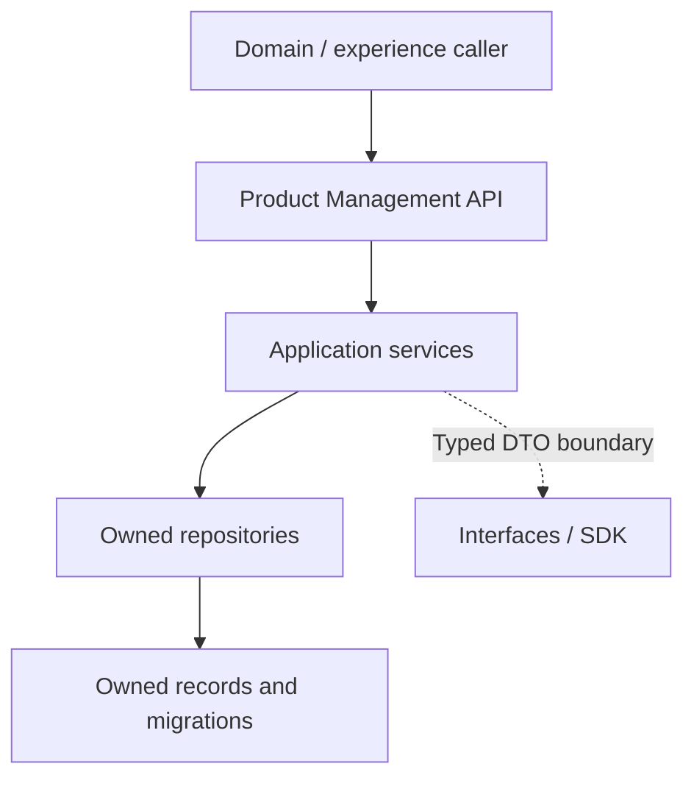

<a href="https://fireflysoftware.io/openplatform/">
<picture>
  <source media="(max-width: 640px) and (prefers-color-scheme: dark)" srcset="https://raw.githubusercontent.com/fireflysoftwaresolutions/.github/main/profile/assets/banner-narrow-dark.svg">
  <source media="(max-width: 640px)" srcset="https://raw.githubusercontent.com/fireflysoftwaresolutions/.github/main/profile/assets/banner-narrow-light.svg">
  <source media="(prefers-color-scheme: dark)" srcset="https://raw.githubusercontent.com/fireflysoftwaresolutions/.github/main/profile/assets/banner-dark.svg">
  
</picture>
</a>

# Product Management

Core data service for product definitions, versions, features, parameters, and related product records in Firefly OpenPlatform.

[Platform documentation](https://docs.fireflysoftware.io/) · [Source reference](docs/openplatform/reference.md) · [Source inventory](docs/openplatform/source-inventory.json)

## Purpose, scope, and readiness

This service owns product definitions, versions, features, parameters, and related product records. Its controllers expose typed record operations; services and repositories apply the local persistence and lifecycle behavior. Domain and experience services compose those operations into customer or staff journeys.

The governed definition foundation provides typed profile rules and native storage integrity. Its native tables remain unavailable by default. Operational lifecycle APIs, product observations, customer offers and the staff wizard require further integration; definitions remain NOT_ADMITTED.

## Business ownership and supported journeys

Store product master data consumed by catalog publication, eligibility, pricing, and origination flows.

Product master records do not execute pricing rules or independently authorize a customer offer. Consumers must resolve an applicable published configuration.

| Entry point | Declared operations |
| --- | --- |
| [ProductCategoryController](core-common-product-mgmt-web/src/main/java/io/fireflysoftware/core/product/web/controllers/ProductCategoryController.java) | `GET /api/v1/categories/{categoryId}`; `POST /api/v1/categories/filter`; `POST /api/v1/categories`; 2 more declarations |
| [ProductConfigurationController](core-common-product-mgmt-web/src/main/java/io/fireflysoftware/core/product/web/controllers/ProductConfigurationController.java) | `GET /api/v1/products/{productId}/configurations/{configId}`; `GET /api/v1/products/{productId}/configurations/by-key/{configKey}`; `GET /api/v1/products/{productId}/configurations/by-type/{configType}`; 4 more declarations |
| [ProductController](core-common-product-mgmt-web/src/main/java/io/fireflysoftware/core/product/web/controllers/ProductController.java) | `GET /api/v1/products/{productId}`; `POST /api/v1/products/filter`; `POST /api/v1/products`; 2 more declarations |
| [ProductDocumentationController](core-common-product-mgmt-web/src/main/java/io/fireflysoftware/core/product/web/controllers/ProductDocumentationController.java) | `GET /api/v1/products/{productId}/documentation/{docId}`; `POST /api/v1/products/{productId}/documentation/filter`; `POST /api/v1/products/{productId}/documentation`; 2 more declarations |
| [ProductDocumentationRequirementController](core-common-product-mgmt-web/src/main/java/io/fireflysoftware/core/product/web/controllers/ProductDocumentationRequirementController.java) | `GET /api/v1/products/{productId}/documentation-requirements/{requirementId}`; `GET /api/v1/products/{productId}/documentation-requirements/by-type/{docType}`; `GET /api/v1/products/{productId}/documentation-requirements/mandatory`; 4 more declarations |
| [ProductLocalizationController](core-common-product-mgmt-web/src/main/java/io/fireflysoftware/core/product/web/controllers/ProductLocalizationController.java) | `GET /api/v1/products/{productId}/localizations/{localizationId}`; `POST /api/v1/products/{productId}/localizations/filter`; `POST /api/v1/products/{productId}/localizations`; 2 more declarations |
| [ProductPricingAggregatorController](core-common-product-mgmt-web/src/main/java/io/fireflysoftware/core/product/web/controllers/ProductPricingAggregatorController.java) | `GET /api/v1/products/{productId}/pricing`; `GET /api/v1/products/with-pricing` |
| [ProductRelationshipController](core-common-product-mgmt-web/src/main/java/io/fireflysoftware/core/product/web/controllers/ProductRelationshipController.java) | `GET /api/v1/products/{productId}/relationships/{relationshipId}`; `POST /api/v1/products/{productId}/relationships/filter`; `POST /api/v1/products/{productId}/relationships`; 2 more declarations |
| [ProductVersionController](core-common-product-mgmt-web/src/main/java/io/fireflysoftware/core/product/web/controllers/ProductVersionController.java) | `GET /api/v1/products/{productId}/versions/{versionId}`; `POST /api/v1/products/{productId}/versions/filter`; `POST /api/v1/products/{productId}/versions`; 2 more declarations |

The complete [operation reference](docs/openplatform/reference.md#http-operations) lists each mapping and its owning method. These are source declarations; conditional beans, inherited controllers, security filters, and deployment routing can change the effective runtime API.

## Consumer example: protect an active product definition

Start with this repository-owned executable contract before connecting a full runtime. Use the JDK required by the effective parent, Maven, and the matching internal artifacts. The selected test defines its own collaborators; no provider credentials should be added to it. Run from this repository root:

```sh
mvn -B -pl core-common-product-mgmt-core -am test -DskipOpenApiGen \
  -Dtest=ProductServiceImplTest -Dsurefire.failIfNoSpecifiedTests=false
```

Runtime integration remains gated on the service configuration and selected adapters described below. The local port and bean-selection inventory below distinguishes the declared abstraction from its configured implementation. An SDK client is an outbound integration; its presence does not establish a working provider connection. Where a sandbox adapter is selected, its behavior is synthetic and limited to what that adapter implements.

**Inputs and fixture ownership.** The complete linked test class supplies its imports, setup, synthetic IDs and collaborators. Run that class as shown; the excerpt is not a standalone Java program. Mocked collaborators include `ProductRepository`, `ProductMapper`. For a deployed call, replace fixture IDs with IDs returned by the owning record-creation API and keep tenant/parent associations intact. The request values and assertions below describe this test boundary only.

```java
@Test
    void deleteProduct_keepsAnOfferedDefinition() {
        Product product = new Product();
        product.setProductId(productId);
        product.setProductStatus(ProductStatusEnum.ACTIVE);
        when(repository.findById(productId)).thenReturn(Mono.just(product));

        StepVerifier.create(service.deleteProduct(productId))
                .expectErrorMatches(error -> error.getMessage().contains("cannot be deleted"))
                .verify();

        verify(repository, never()).deleteById(productId);
    }
```

**Expected behavior.** Deleting an ACTIVE product fails and the repository delete operation is never called. Retire or transition a product through the supported lifecycle before removal.

**Verification and recovery.** Run the complete selected test class and inspect its Surefire result: zero failures/errors and at least one executed test are required. A skipped or zero-test build is not evidence. Compare the assertions with the owning DTO/service before extending the request. For a runtime run, separately configure authentication/entitlements and the exact downstream endpoints, migrate/seed disposable owner stores, and reread the returned identifier; these unit/contract fixtures do not establish those prerequisites.

**Execution evidence.** Source checked against the linked test and local declarations. The documentation worker has not run this repository test or the full service. The excerpt is retained from the existing test; mock, in-memory, or local HTTP fixture results are not live-provider acceptance.

Source of this example: [ProductServiceImplTest](core-common-product-mgmt-core/src/test/java/io/fireflysoftware/core/product/core/services/impl/ProductServiceImplTest.java), [ProductMapper](core-common-product-mgmt-core/src/main/java/io/fireflysoftware/core/product/core/mappers/ProductMapper.java), [ProductStatusEnum](core-common-product-mgmt-interfaces/src/main/java/io/fireflysoftware/core/product/interfaces/enums/ProductStatusEnum.java), [Product](core-common-product-mgmt-models/src/main/java/io/fireflysoftware/core/product/models/entities/Product.java), [ProductRepository](core-common-product-mgmt-models/src/main/java/io/fireflysoftware/core/product/models/repositories/ProductRepository.java).

## Architecture and repository layout


```mermaid
flowchart TB
    D["Domain / experience caller"] --> W["Product Management API"]
    W --> S["Application services"]
    S --> R["Owned repositories"]
    R --> DB["Owned records and migrations"]
    S -. "Typed DTO boundary" .-> C["Interfaces / SDK"]
```

| Module | Responsibility |
| --- | --- |
| [core-common-product-mgmt-core](core-common-product-mgmt-core/) | Application services, handlers, and business coordination; inspect these implementations for lifecycle rules. |
| [core-common-product-mgmt-interfaces](core-common-product-mgmt-interfaces/) | Public DTOs, commands, queries, and contracts shared across the module boundary. |
| [core-common-product-mgmt-models](core-common-product-mgmt-models/) | Persisted entities, repositories, and database migrations; this is the data ownership boundary. |
| [core-common-product-mgmt-web](core-common-product-mgmt-web/) | HTTP entry points, boot application, and runtime configuration. |
| [core-common-product-mgmt-sdk](core-common-product-mgmt-sdk/) | Client artifact and OpenAPI generation configuration; build it from the matching service contract. |

## Contracts, data, authentication, and errors

Legacy product/configuration APIs remain separate from immutable governed definitions. The native foundation separates public terms and private costs, binds a new Product to its root, and rejects legacy child writes across enrollment. Follow the [governed definition and native storage guide](docs/governed-product-definitions.md) for migration prerequisites, compatibility and recovery.

| Data type | Declared fields (selection) |
| --- | --- |
| [Product](core-common-product-mgmt-models/src/main/java/io/fireflysoftware/core/product/models/entities/Product.java) | `productId`, `tenantId`, `productCategoryId`, `productType`, `productName`, `productCode`, `productDescription` |
| [ProductCategory](core-common-product-mgmt-models/src/main/java/io/fireflysoftware/core/product/models/entities/ProductCategory.java) | `productCategoryId`, `categoryName`, `categoryDescription`, `parentCategoryId`, `level` |
| [ProductConfiguration](core-common-product-mgmt-models/src/main/java/io/fireflysoftware/core/product/models/entities/ProductConfiguration.java) | `productConfigurationId`, `productId`, `configType`, `configKey`, `configValue` |
| [ProductDocumentation](core-common-product-mgmt-models/src/main/java/io/fireflysoftware/core/product/models/entities/ProductDocumentation.java) | `productDocumentationId`, `productId`, `docType`, `documentManagerRef`, `dateAdded` |
| [ProductDocumentationRequirement](core-common-product-mgmt-models/src/main/java/io/fireflysoftware/core/product/models/entities/ProductDocumentationRequirement.java) | `productDocRequirementId`, `productId`, `docType`, `isMandatory`, `description` |
| [ProductLocalization](core-common-product-mgmt-models/src/main/java/io/fireflysoftware/core/product/models/entities/ProductLocalization.java) | `productLocalizationId`, `productId`, `languageCode`, `localizedName`, `localizedDescription` |
| [ProductRelationship](core-common-product-mgmt-models/src/main/java/io/fireflysoftware/core/product/models/entities/ProductRelationship.java) | `productRelationshipId`, `productId`, `relatedProductId`, `relationshipType`, `description` |
| [ProductVersion](core-common-product-mgmt-models/src/main/java/io/fireflysoftware/core/product/models/entities/ProductVersion.java) | `productVersionId`, `productId`, `versionNumber`, `versionDescription`, `effectiveDate` |

The [data contract reference](docs/openplatform/reference.md#data-contracts) indexes **25 DTO, record, or entity declarations** and their fields. Read DTO validation annotations together with service logic and migrations; a field's presence does not establish that every endpoint accepts it.

Use the authentication and authorization behavior actually enforced by the deployed entry point. Tenant, party, distributor, and staff identifiers carry business scope; they must not be accepted as proof of identity. Preserve validation and downstream errors rather than mapping an unavailable dependency to a successful business result.

Examples of locally enforced failure or access behavior:

| Declared check or failure | Implementation |
| --- | --- |
| `new RuntimeException("Error parsing product marketing_features JSON", e);` | [ProductMapper](core-common-product-mgmt-core/src/main/java/io/fireflysoftware/core/product/core/mappers/ProductMapper.java) |
| `new RuntimeException("Error serialising product marketing_features", e);` | [ProductMapper](core-common-product-mgmt-core/src/main/java/io/fireflysoftware/core/product/core/mappers/ProductMapper.java) |
| `new IllegalArgumentException("COST_DEFINITION_INVALID");` | [CostRules](core-common-product-mgmt-core/src/main/java/io/fireflysoftware/core/product/core/services/definition/v1/CostRules.java) |
| `new IllegalStateException("SHA-256 unavailable", e);` | [DefinitionCanonical](core-common-product-mgmt-core/src/main/java/io/fireflysoftware/core/product/core/services/definition/v1/DefinitionCanonical.java) |
| `new IllegalArgumentException("DEFINITION_SHAPE");` | [DefinitionCanonical](core-common-product-mgmt-core/src/main/java/io/fireflysoftware/core/product/core/services/definition/v1/DefinitionCanonical.java) |
| `new IllegalArgumentException("CHECKER_IDENTITY_REQUIRED");` | [DefinitionReviewRules](core-common-product-mgmt-core/src/main/java/io/fireflysoftware/core/product/core/services/definition/v1/DefinitionReviewRules.java) |

The [security and failure reference](docs/openplatform/reference.md#security-and-failure-evidence) links local authorization annotations, status mappings, and exception sites. Framework or gateway policy is additional to this local inventory; verify the deployed filter chain and caller entitlements before integration.

## External dependencies, sandbox behavior, and replacement

The local port and bean-selection inventory below distinguishes the declared abstraction from its configured implementation. An SDK client is an outbound integration; its presence does not establish a working provider connection. Where a sandbox adapter is selected, its behavior is synthetic and limited to what that adapter implements.

For a project-specific provider, implement the existing typed boundary and select it through the repository wiring. Preserve the caller-visible validation, lifecycle, error, correlation, and retry semantics; verify both successful and failed requests against the same contract. Supply endpoint/credentials through configuration. If no sandbox selector is listed, do not invent one or silently introduce sample success as a fallback.

## Configuration and local setup

Runtime configuration sources: [openapi.yml](core-common-product-mgmt-sdk/src/main/resources/api-spec/openapi.yml), [openapi.yml](core-common-product-mgmt-sdk/src/main/resources/openapi.yml), [ProductManagementApplication.java](core-common-product-mgmt-web/src/main/java/io/fireflysoftware/core/product/web/ProductManagementApplication.java), [application.yaml](core-common-product-mgmt-web/src/main/resources/application.yaml).

| Environment variable or property | Declared fallback |
| --- | --- |
| `DB_HOST` | `localhost` |
| `DB_PORT` | `5432` |
| `DB_NAME` | `postgres` |
| `DB_USERNAME` | `postgres` |
| `DB_PASSWORD` | `[redacted]` |
| `DB_SSL_MODE` | `disable` |
| `spring.application.name` | Required by this expression |
| `spring.application.version` | Required by this expression |
| `spring.application.description` | Required by this expression |
| `spring.application.team.name` | Required by this expression |
| `spring.application.team.email` | Required by this expression |
| `DB_HOST` | Required by this expression |
| `DB_PORT` | Required by this expression |
| `DB_NAME` | Required by this expression |
| `DB_SSL_MODE` | Required by this expression |
| `DB_USERNAME` | Required by this expression |
| `DB_PASSWORD` | Required by this expression |
| `SERVER_ADDRESS` | `localhost` |
| `SERVER_PORT` | `8080` |

See the [complete configuration reference](docs/openplatform/reference.md#configuration) for every placeholder and its source, including differences between profiles. A fallback is a code default, not a deployment recommendation. Secret defaults are redacted.

Build coordinates: `io.fireflysoftware:core-common-product-mgmt:26.10.6`. Parent: `io.fireflysoftware:firefly-parent:26.10.6`. The POM is the compatibility source of truth.

Use the CI-declared JDK `25` and Maven available on your path. This root POM declares `java.version` / compiler release `25`; a lower source target does not lower the JDK needed to consume framework dependencies. Resolve the parent/BOM and internal SDK artifacts before launching a child module. The framework baseline comes through `firefly-parent`; provider adapters should use the corresponding Jafly modules instead of duplicating framework infrastructure.

```sh
mvn --version
mvn -B verify
```

`verify` compiles the reactor and executes the checks bound by the effective POM. A successful dependency resolution or skipped-test package is not a test result. SDK generation may require a running API specification endpoint; inspect the SDK POM before selecting its generation profile.

The current OpenPlatform parent enables `generate-openapi` when `skipOpenApiGen` is absent. Applicable web modules start an OpenAPI generation application on port **18080**, fetch `/v3/api-docs.yaml`, and stop it during the integration-test lifecycle. To validate code against the checked-in API specification without that application-startup step, use:

```sh
mvn -B verify -DskipOpenApiGen
```

This switch does not skip tests or the SDK module's own source generation. It does omit fresh application-generated OpenAPI evidence; run the complete configured lifecycle when qualifying an API change.

After dependencies and configuration are ready, build/install reactor artifacts and launch the web module:

```sh
mvn -B install
mvn -pl core-common-product-mgmt-web spring-boot:run
```

Run against disposable local infrastructure first. Supply endpoint/database variables from the configuration reference; a default localhost URL does not start that dependency.

Locally declared build plugins: `maven-compiler-plugin`, `maven-resources-plugin`, `openapi-generator-maven-plugin`, `spring-boot-maven-plugin`. Inherited checks remain governed by the parent POM.

The checkout contains **21 test source/resource files**. See the [test source index](docs/openplatform/reference.md#test-sources) for coverage locations. This inventory is not evidence that those tests passed.

CI definitions: [maven-central.yml](.github/workflows/maven-central.yml), [release.yml](.github/workflows/release.yml).

## Operations and recovery

On failure, retain the request and business record identifiers, inspect the owning controller/service and downstream status, then verify the current persisted state before retrying. Distinguish invalid input, denied access, missing records, and unavailable infrastructure. Avoid replaying a financial or externally visible action until its prior effect is known. For persistent modules, review the migration history and use the deployment rollback procedure; do not erase records to recover a failed request.

Database evolution is represented by 18 migration files in [core-common-product-mgmt-models/src/main/resources/db/migration](core-common-product-mgmt-models/src/main/resources/db/migration/). Review the last applied migration and the owning entity before diagnosing a schema mismatch.

Existing test scenarios provide concrete starting points for failure reproduction:

- `getCategoryById_Success` — [ProductCategoryServiceImplTest](core-common-product-mgmt-core/src/test/java/io/fireflysoftware/core/product/core/services/category/v1/ProductCategoryServiceImplTest.java)
- `getCategoryById_NotFound` — [ProductCategoryServiceImplTest](core-common-product-mgmt-core/src/test/java/io/fireflysoftware/core/product/core/services/category/v1/ProductCategoryServiceImplTest.java)
- `create_Success` — [ProductCategoryServiceImplTest](core-common-product-mgmt-core/src/test/java/io/fireflysoftware/core/product/core/services/category/v1/ProductCategoryServiceImplTest.java)
- `createCategory_RootCategory_Success` — [ProductCategoryServiceImplTest](core-common-product-mgmt-core/src/test/java/io/fireflysoftware/core/product/core/services/category/v1/ProductCategoryServiceImplTest.java)
- `createCategory_Error` — [ProductCategoryServiceImplTest](core-common-product-mgmt-core/src/test/java/io/fireflysoftware/core/product/core/services/category/v1/ProductCategoryServiceImplTest.java)
- `update_Success` — [ProductCategoryServiceImplTest](core-common-product-mgmt-core/src/test/java/io/fireflysoftware/core/product/core/services/category/v1/ProductCategoryServiceImplTest.java)
- `updateCategory_CircularReference_SelfParent` — [ProductCategoryServiceImplTest](core-common-product-mgmt-core/src/test/java/io/fireflysoftware/core/product/core/services/category/v1/ProductCategoryServiceImplTest.java)
- `updateCategory_NotFound` — [ProductCategoryServiceImplTest](core-common-product-mgmt-core/src/test/java/io/fireflysoftware/core/product/core/services/category/v1/ProductCategoryServiceImplTest.java)

## Compatibility and validation boundaries

Match consumers to the actual producer/OpenAPI and declared parent/BOM. This native storage checkpoint adds no operational definition API or handwritten SDK. Existing mutable pricing rows do not establish an approved customer quote, assessed fees or financial admission. Normal SDK generation remains separate from this storage verification.

Platform and framework coordinates are enumerated in the [build reference](docs/openplatform/reference.md#build-and-dependencies). Keep the API/SDK and parent/BOM release line aligned; an omitted dependency version is managed upstream, not independently pinned here.

Documentation generation checks source freshness and local references. It does not certify compilation, test success, database migration safety, provider connectivity, regulatory approval, or end-to-end customer acceptance.

## Further reading, contribution, and license

- [Governed product definitions and native storage](docs/governed-product-definitions.md)

Contributions should describe the affected business contract, update its tests and documentation together, and include the configured verification results. Review the source reference before changing public types or dependency boundaries.

Use is governed by the repository [license](LICENSE).

<!-- Maintained by .github/scripts/documentation/generate.py and curated.json. Edit editorial inputs, then regenerate. -->
